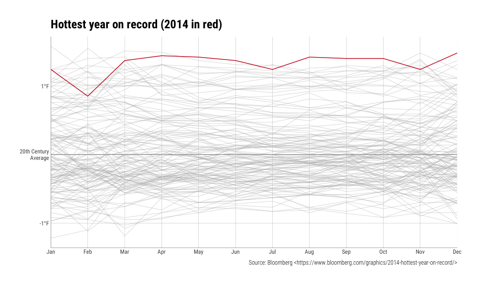

[](https://travis-ci.org/hrbrmstr/burrp)

`burrp` : Tools to Import and Process [PortSwigger](https://portswigger.net/) 'Burp' Proxy Data

The Burp Suite is a set of web application and security testing tools. Combined, they intercept, record and can even transform browser traffic.

It is often necessary to use an intercepting proxy server to identify targets for web-scraping. The 'PortSwigger' 'Burp' proxy records web traffic from interactive use of a browser and provides mechanisms to archive this activity to an XML file for further processing. Tools are provides to import this archive file and work with the request and response objects in a similar manner as one would with results of verb calls from functions in the 'httr' package.

For now, the solo function - `read_burp` - expects the `request` and `response` elements of a Burp XML export file to be base 64 encoded.

Eventually there will likely be an `as_har()` function to turn the entire structure into a `HARtools` object.

To use this package you either need to have Burp proxy export files handy, use the built-in example data file or [download Burp](https://portswigger.net/burp/) and capture some web traffic and export the data.

The current Burp proxy example capture file is of a capture from the [Bloomberg Hottest Year on Record](https://www.bloomberg.com/graphics/2014-hottest-year-on-record/) scrollytelling datavis. It's a good example of how to use Burp to capture requests as you interactively work in a browser (you can get the JSON data behind the vis this way, too).

The following functions are implemented:

-   `read_burp`: Read in a Burp proxy XML export file
-   `find_sequence`: Find the first occurrence (if any) of a sequence of raw bytes ('pattern') in 'buffer'
-   `extension_is`: Functional helpers
-   `method_is`: Functional helpers
-   `mime_is`: Functional helpers
-   `port_is`: Functional helpers
-   `protocol_is`: Functional helpers
-   `status_is`: Functional helpers

### Installation

``` r
devtools::install_github("hrbrmstr/burrp")
```

### Usage

``` r
library(httr)
library(burrp)
library(hrbrthemes) # github
library(tidyverse)

# current verison
packageVersion("burrp")
```

    ## [1] '0.1.0'

``` r
system.file("extdata", "hottest_year.xml", package="burrp") %>%
  read_burp() -> burp_df

glimpse(burp_df)
```

    ## Observations: 15
    ## Variables: 14
    ## $ time           <dttm> 2017-02-19 20:42:20, 2017-02-19 20:42:18, 2017-02-19 20:42:20, 2017-02-19 20:42:20, 2017-02...
    ## $ url            <chr> "https://connect.facebook.net/en_US/all.js", "https://www.bloomberg.com/graphics/2014-hottes...
    ## $ host           <chr> "connect.facebook.net", "www.bloomberg.com", "www.bloomberg.com", "www.bloomberg.com", "www....
    ## $ port           <chr> "443", "443", "443", "443", "443", "443", "443", "443", "443", "443", "443", "443", "80", "4...
    ## $ protocol       <chr> "https", "https", "https", "https", "https", "https", "https", "https", "https", "https", "h...
    ## $ method         <chr> "GET", "GET", "GET", "GET", "GET", "GET", "GET", "GET", "GET", "GET", "GET", "GET", "GET", "...
    ## $ path           <chr> "/en_US/all.js", "/graphics/2014-hottest-year-on-record/", "/graphics/2014-hottest-year-on-r...
    ## $ extension      <chr> "js", "null", "json", "svg", "svg", "js", "js", "js", "js", "js", "js", "js", "null", "html"...
    ## $ request        <list> [<GET, https://connect.facebook.net/en_US/all.js, connect.facebook.net, Mozilla/5.0 (Macint...
    ## $ status         <chr> "200", "200", "200", "200", "200", "200", "200", "200", "200", "200", "200", "200", "301", "...
    ## $ responselength <dbl> 197770, 46838, 49141, 4264, 3812, 3116, 12571, 147196, 19182, 1101, 4993, 14939, 884, 1663, 474
    ## $ mimetype       <chr> "script", "HTML", "JSON", "XML", "XML", "script", "script", "script", "script", "script", "s...
    ## $ response       <list> [<https://connect.facebook.net/en_US/all.js, 200, X-FB-Content-MD5, 54d8ccb495d0adf5b0de286...
    ## $ comment        <chr> "", "", "", "", "", "", "", "", "", "", "", "", "", "", ""

``` r
burp_df$request[[3]]
```

    ## <request>
    ## GET https://www.bloomberg.com/graphics/2014-hottest-year-on-record/data.json
    ## Output: list
    ## Options:
    ## * useragent: NULL
    ## * post: FALSE
    ## * postfieldsize: 2
    ## * postfields: as.raw(c(0x00, 0x0a))
    ## Headers:
    ## * host: www.bloomberg.com
    ## * user-agent: Mozilla/5.0 (Macintosh; Intel Mac OS X 10.12; rv:51.0) Gecko/20100101 Firefox/51.0
    ## * accept: application/json,*/*
    ## * accept-language: en-US,en;q=0.5
    ## * referer: https://www.bloomberg.com/graphics/2014-hottest-year-on-record/
    ## * cookie: SRV=YPX01; ak_rg=US; ak_co=US; GRAPHICS_AP=ny04; bdfpc=null
    ## * connection: close

``` r
burp_df$response[[3]]
```

    ## Response [https://www.bloomberg.com/graphics/2014-hottest-year-on-record/data.json]
    ##   Date: 2017-02-19 20:42
    ##   Status: 200
    ##   Content-Type: application/json
    ##   Size: 48.7 kB

``` r
content(burp_df$response[[3]], simplifyDataFrame=TRUE) %>% 
  unnest() %>% 
  filter(key != "0") %>% 
  mutate(key=factor(key, levels=as.character(1:12), labels=month.abb)) %>% 
  mutate(color=ifelse(year=="2014", "#cb181d", "#b5b5b5")) %>% 
  mutate(size=ifelse(year=="2014", 0.5, 0.15)) %>% 
  ggplot(aes(key, value, group=year, color=color, size=size)) +
  geom_hline(yintercept = 0, size=0.2) +
  geom_line() +
  scale_x_discrete(expand=c(0,0)) +
  scale_y_continuous(breaks=c(-1, 0, 1), labels=c("-1°F", "20th Century\nAverage", "1°F")) +
  scale_color_identity() +
  scale_size_identity() +
  labs(x=NULL, y=NULL, title="Hottest year on record (2014 in red)",
       caption="Source: Bloomberg <https://www.bloomberg.com/graphics/2014-hottest-year-on-record/>") +
  theme_ipsum_rc(grid="XY", axis="xy") +
  theme(legend.position="none")
```



``` r
summary(burp_df)
```

    ## <Burp Proxy Export>
    ## - 15 total records
    ## 
    ## # A tibble: 2 × 3
    ##   status       description     n
    ##    <chr>             <chr> <int>
    ## 1    200                OK    14
    ## 2    301 Moved Permanently     1
    ## 
    ## # A tibble: 2 × 2
    ##    port     n
    ##   <chr> <int>
    ## 1   443    14
    ## 2    80     1
    ## 
    ## # A tibble: 2 × 2
    ##   protocol     n
    ##      <chr> <int>
    ## 1    https    14
    ## 2     http     1
    ## 
    ## # A tibble: 1 × 2
    ##   method     n
    ##    <chr> <int>
    ## 1    GET    15
    ## 
    ## # A tibble: 5 × 2
    ##   extension     n
    ##       <chr> <int>
    ## 1        js     9
    ## 2      null     2
    ## 3       svg     2
    ## 4      html     1
    ## 5      json     1

### Test Results

``` r
library(burrp)
library(testthat)

date()
```

    ## [1] "Mon Feb 20 22:56:59 2017"

``` r
test_dir("tests/")
```

    ## testthat results ========================================================================================================
    ## OK: 1 SKIPPED: 0 FAILED: 0
    ## 
    ## DONE ===================================================================================================================
